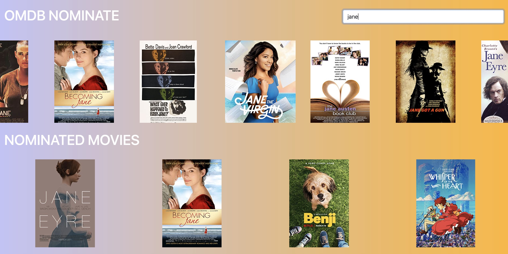

# OMDB NOMINATE 🏆📽

  # Table of Contents

  - [Usage](#Usage)
  - [Challenge](#Challenge)
  - [Requirements](#Requirements)
  - [Extra](#Extra)

   
   

# Usage

Unfortunately, I could not deploy this application. It is available on http://localhost:3000.

# Challenge

We need a webpage that can search OMDB for movies, and allow the user to save their favourite films they feel should be up for nomination. When they've selected 5 nominees they should be notified they're finished.

We'd like a simple to use interface that makes it easy to:
Search OMDB and display the results (movies only)
Add a movie from the search results to our nomination list
View the list of films already nominated
Remove a nominee from the nomination list

# Requirements

1. Search results should come from OMDB's API (free API key: http://www.omdbapi.com/apikey.aspx).✅
2. Each search result should list at least its title, year of release and a button to nominate that film.✅
3. Updates to the search terms should update the result list
Movies in search results can be added and removed from the nomination list.✅
4. If a search result has already been nominated, disable its nominate button.✅
5. Display a banner when the user has 5 nominations.❌

Extras

There is a lot to be improved on here, you can polish the required features by crafting a nicer design, or improve the app by adding new features! Choose something that you feel best showcases your passion and skills.

If you need inspiration, here are examples of what you can work on. If you work on these ideas, we recommend choosing only one or two.

  1. Save nomination lists if the user leaves the page. ✅
  2. Animations for loading, adding/deleting movies, notifications
  3. Create shareable links
 

# Links
:octocat: Github [Repo](https://github.com/jmorris107/OMDB-Challenge.github.io) / [Account](https://github.com/) 
📃 [My Potfolio](https://react-portfolio-jennifer.herokuapp.com/) 
 
  
